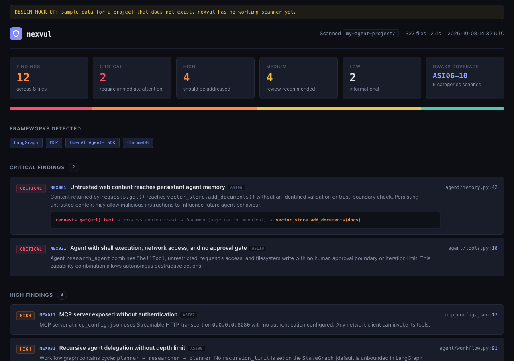

<p align="center">
  
</p>

<p align="center"><sub><b>Design mock-up.</b> Sample data, not real scan output. nexvul has no working scanner yet. The full-page mock-up is in <a href="assets/screenshots/dashboard-full.png">assets/screenshots/dashboard-full.png</a> and the source is <a href="assets/report-preview.html">assets/report-preview.html</a>.</sub></p>

# nexvul

**A local-first static security scanner for AI-agent applications.**

nexvul reads Python and TypeScript/JavaScript agent code, prompts, tool definitions, MCP configurations and
agent workflow definitions, and reports risky patterns mapped to the
[OWASP Top 10 for Agentic Applications](https://genai.owasp.org/) — with an initial focus on:

| ID    | Risk                                  |
|-------|---------------------------------------|
| ASI06 | Memory & Context Poisoning            |
| ASI07 | Insecure Inter-Agent Communication    |
| ASI08 | Cascading Failures                    |
| ASI09 | Human-Agent Trust Exploitation        |
| ASI10 | Rogue Agents                          |

> ⚠️ **A clean nexvul result does not prove that an application is secure.** nexvul finds specific, explainable
> risky patterns. It cannot see runtime behaviour, deployment configuration, model behaviour, or anything it has
> no rule for.

## Status

**Phase 0 — research and design. There is no working scanner yet.** Nothing in this repository should be
installed or relied on. The roadmap, threat model, architecture and detection taxonomy are being written first;
implementation starts only after that foundation is reviewed.

| Phase | Scope                                              | State        |
|-------|----------------------------------------------------|--------------|
| 0     | Research, threat model, architecture, taxonomy     | In progress  |
| 1     | CLI, discovery, Python AST engine, reporters       | Not started  |
| 2     | Initial ASI06–ASI10 rules                          | Not started  |
| 3     | Symbols, call graph, cross-file taint              | Not started  |
| 4     | Framework support                                  | Not started  |
| 5     | JS/TS                                              | Not started  |
| 6     | SARIF, GitHub Action, pre-commit                   | Not started  |
| 7     | Benchmarking                                       | Not started  |
| 8     | Hardening (red-teaming nexvul itself)              | Not started  |
| 9     | Release                                            | Not started  |

## Why another scanner?

Several AI-agent scanners already exist (see the [competitive research](docs/research/competitors/README.md)). nexvul is aiming at gaps that research found in all of them:

- **Cross-file taint analysis** for memory and context poisoning (ASI06). None of the tools reviewed track taint across modules.
- **Working JS/TS parsing** with a real parser instead of line heuristics.
- **A self-contained HTML report** (the mock-up above) alongside terminal, JSON and SARIF output.
- **Fully local operation.** No API key, no LLM calls, and no execution of the scanned project's code.

These are goals, not shipped features. Each will be claimed only after it is built and measured on a benchmark corpus.

## Principles

- **Local-first.** Your source code never leaves your machine. No telemetry. No network calls needed to scan.
- **The scanned code is untrusted.** nexvul never executes, imports or instantiates the project it scans, and it
  is built to fail safely on hostile input (giant files, deep nesting, symlinks, malformed configs).
- **Explainable.** Every finding states the source, the flow, the sink, and why it matters — never just
  "this looks dangerous."
- **Precision over volume.** A rule ships only after its false-positive behaviour is understood and measured.

## Planned usage

These commands are the design target and **do not work yet**:

```bash
nexvul scan .
nexvul scan . --format sarif
nexvul explain NEX001
```

## Repository layout

- [`docs/brief/master-brief.md`](docs/brief/master-brief.md) — the product brief everything else derives from
- `docs/` — research, threat model, architecture, taxonomy, OWASP mappings, ADRs (in progress)
- `.nexvul/` — the engineering team's working artefacts: tasks, decisions, reviews

## License

Not yet chosen. Until a license file is added, no rights are granted to use, copy or modify this code.
